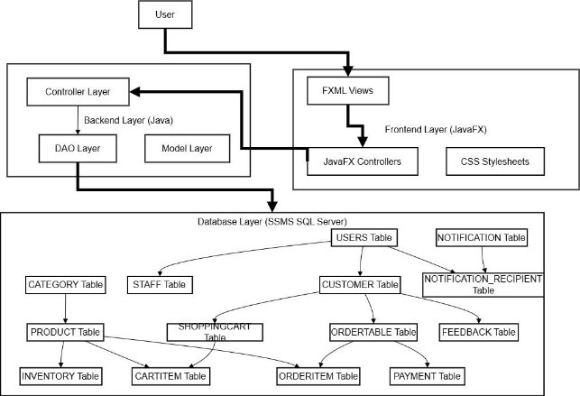

# TradeTrack

**by**

## Software Requirements Specification

### Table of Contents

#### Introduction
1. Purpose
1. Product Scope
1. Title
1. Objectives
1. Problem Statement
#### Overall Description
1. Product Perspective
1. Product Functions
1. List of Use Cases
1. Use Case Diagram
#### Other Nonfunctional Requirements
1. Performance Requirements
1. Safety Requirements
1. Security Requirements
1. Software Quality Attributes
1. Business Rules 
1. Operating Environment
1. User Interfaces
#### Domain Model
#### System Sequence Diagram
#### Sequence Diagrams
#### Class Diagram
#### Component Diagram
#### Package Diagram
#### Deployment Diagram

************************************

## Introduction

### 1. **Purpose**

*The software requirements document describes TradeTrack, an integrated desktop-based application. TradeTrack merges eCommerce functionalities with inventory management to streamline retail operations for SaveMart. It covers key areas, including eCommerce management, inventory tracking, and analytics. This SRS outlines the entire system.*

### 2. **Product Scope**

*TradeTrack is designed for Metro Cash and Carry’s retail operations. It combines eCommerce and inventory management to reduce manual errors, automate processes, and facilitate real-time synchronization of data. The system will address current inefficiencies in retail by:*

- *Managing online sales and payments.*
- *Tracking inventory and automating reordering.*
- *Generating reports for strategic decision-making.*

### 3. **Title**

*TradeTrack: An Integrated eCommerce and Inventory Management System for Retail Operations*

### 4. **Objectives**

*Streamline operations by merging eCommerce and inventory systems.*

*Provide real-time inventory updates and automate stock adjustments.*

*Enhance customer satisfaction through accurate order tracking and timely fulfillment. Offer analytics for informed decision-making.*

*Create a scalable and user-friendly solution with robust security measures.*

### 5. **Problem Statement**

*Retail businesses face inefficiencies due to disconnected eCommerce and inventory systems:*

*Manual Errors: Prone to data discrepancies.*

*Operational Inefficiencies: Redundant data entry increases workload.*

*Customer Dissatisfaction: Delays in order processing and stock inaccuracies.*

*TradeTrack solves these issues by integrating eCommerce and inventory management into a cohesive system.*

## **Overall Description**
### 1. **Product Perspective**

*TradeTrack is a new, self-contained system addressing gaps in existing solutions by providing:*

*Integrated inventory and sales tracking.*

*Automation of key operations like reordering and reporting.*

*Diagram: Displays system components, subsystems (eCommerce, inventory management), and interfaces.*

### 2. **Product Functions**

*Manage online customer orders and payments. Track and reorder inventory automatically.*

*Generate analytics for sales, inventory, and finances.*

### 3. **List of Use Cases**
1. **View Product Catalog**
1. **Place Order**
1. **Track Order Status**
1. **View Order History**
1. **Notify Low Stock Levels**
1. **Set Restock Levels**
1. **Restock Inventory**
1. **Manage Users**
1. **Manage Products**
1. **Send Order Confirmation**
1. **View Inventory Status**
1. **Manage Customer Feedback**
1. **Manage Orders**

### 5. **Use Case Diagram**

## **Other Nonfunctional Requirements**
### 1. **Performance Requirements**

*Real-time updates for inventory and order statuses.*

*Handle up to 10,000 concurrent user requests without degradation.*

### 2. **Safety Requirements**

*Prevent data loss during system crashes via periodic backups. Ensure regulatory compliance with data protection standards.*

### 3. **Security Requirements**

*Encrypted communication for sensitive data.*

*Role-based access control for Store Managers and Customers.*

### 4. **Software Quality Attributes**

*Adaptability: Compatible with future extensions. Reliability: Ensure 99.9% uptime.*

*Usability: Intuitive interfaces for non-technical users.*

### 5. **Business Rules**

*Only Store Managers can approve refunds. Warehouse Staff manages restocking processes.*

### 6. **Operating Environment**

*Hardware: Windows/Linux desktops with a minimum of 8GB RAM. Software: Java-based application using SQL Server for the database.*

### 7. **User Interfaces**

**Admin:**

The admin interface provides comprehensive control over the system, enabling the management of user accounts, permissions, and overall system configurations. Admins can oversee inventory, monitor sales analytics, and generate reports. Additionally, they can resolve escalations from other roles and maintain system security.

**WarehouseStaff:**

The warehouse staff interface focuses on inventory management and order fulfillment. Staff can view incoming and outgoing stock, update inventory levels, and track stock movements. The interface also supports scanning products for faster processing and provides alerts for low stock or discrepancies during audits.

**Customer:**

The customer interface is designed for shopping convenience, allowing users to browse products, add items to their cart, and complete secure checkouts. Customers can track their orders, view past purchases, and manage their profile details. The interface also provides personalized recommendations and promotional offers.

4. **Domain Model**

5. **System Sequence Diagram**

   

6. **Sequence Diagram**

**Manage Orders :**

**Manage Feedback:**

**Restock Inventory:**

**Notify Low Stock:**

**Manage Products:**

**View Products:**

7. **Class Diagram**

8. **Component Diagram**

9. **Package Diagram**

10. **Deployment Diagram**

